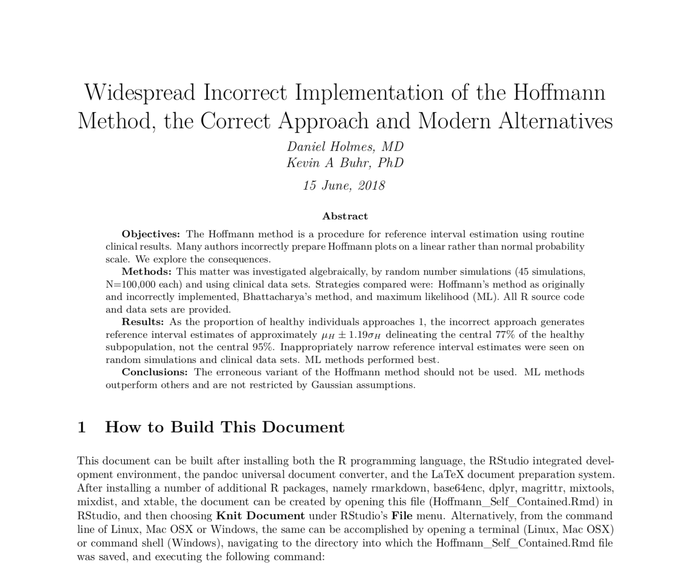
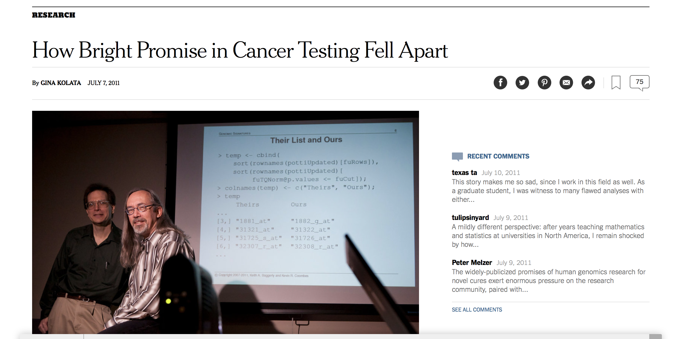

```{r setup, include=FALSE}
knitr::opts_chunk$set(echo = FALSE)
```

## Why R?

- What is R?
- How is R different from other scripting languages?
- What kinds of things can you do with R?
- R is more than one thing -- what things is it?


## Things we have done with R

- Automated QC reports
- Requisition scanning, processing and optical character recognition
- Interfacing instruments to Lab Information System: [this article](https://labrtorian.com/2016/02/27/flat-file-interface-your-mass-spectrometer-to-the-laboratory-information-system-with-r-3/)
- [Built Interactive Dashboards](https://bahar.shinyapps.io/method_compare/)
- Key perfomance indicator and and test utilization reports in PDF or HTML.
- [Data automation and reporting for COVID Pooling](https://bit.ly/3irtnHy)

## R for Lab Medicine Stats

- Excel is limited in the number of statistical tools available.
- Many specific lab-specfic-analyses are not present in Excel. 
- Examples include:
    - [Passing Bablok and Deming Regression](http://labrtorian.com/2015/09/14/deming-and-passing-bablok-regression-in-r/)
    - CLSI linearity calculations
    - CLSI precision calculations
    - Non-parametric comparisons
    - Multi-instrument simultaneous comparisons and other customizations

## Example of Rapid Dashboard Development

[University of Washington live COVID stats](http://depts.washington.edu/labmed/covid19/)

## Example of a Useful Visualization

- Let's look at the turnaround time for our physicians' electrophoresis reporting.

```{r pepdata, echo = FALSE, message = FALSE, warning = FALSE}
library(lubridate)
library(knitr)
library(dplyr)
library(ggplot2)
library(plotly)
```

```{r, echo = TRUE}
pep.data <- read.csv("Data/pepdata_anon.csv")
pep.data$RECEIVED_DATE <- ymd_hm(pep.data$RECEIVED_DATE)
pep.data$RESULT_DATE <- ymd_hm(pep.data$RESULT_DATE)
pep.data$DOCTAT <- difftime(pep.data$RESULT_DATE,
                            pep.data$RECEIVED_DATE,
                            units = "hours") %>%
  as.numeric() %>%
  round(.,2)
pep.data <- filter(pep.data, DOCTAT > 0)
```

```{r}
kable(pep.data[,5:7])
```

## Traditional Boxplot

```{r, echo = TRUE}
boxplot(DOCTAT ~ LABDOC,
        data = pep.data,
        col = terrain.colors(6, alpha = 0.6),
        ylim = c(0,300))
```


## Interactive HTML Boxplot
```{r, echo = TRUE}
p <- ggplot(pep.data, aes(x=LABDOC, y=DOCTAT, fill=LABDOC)) + geom_boxplot()
p <- ggplotly(p)
p
```

## Interactive with Overlays

```{r, echo = FALSE}
p <- pep.data %>%
  plot_ly(
    x = ~LABDOC,
    y = ~DOCTAT,
    split = ~LABDOC,
    type = 'violin',
    box = list(
      visible = T
    ),
    meanline = list(
      visible = T
    )
  ) %>% 
  layout(
    xaxis = list(
      title = "Lab Doctor"
    ),
    yaxis = list(
      title = "Signout Turnaround Time by Doctor",
      zeroline = F
    )
  )
p
```

## By Hospital

```{r, echo = FALSE}
p <- pep.data %>%
  plot_ly(
    x = ~RESULTING_LAB,
    y = ~DOCTAT,
    split = ~RESULTING_LAB,
    type = 'violin',
    box = list(
      visible = T
    ),
    meanline = list(
      visible = T
    )
  ) %>% 
  layout(
    xaxis = list(
      title = "Lab Doctor"
    ),
    yaxis = list(
      title = "Signout Turnaround Time by Hospital",
      zeroline = F
    )
  )
p
```

## Specific Lab Medicine Stats

- Let's look at regression using the [mcr package](https://cran.r-project.org/web/packages/mcr/index.html)
- Package is written by statisticians at Roche Diagnostics
- In compliance with CLSI EP09-A3

```{r, echo = FALSE}
# Make some fake data
set.seed(316)
x <- runif(100,0,100)
y <- x + x*rnorm(100,0,0.1) + rnorm(100, 2, 2)
```

- Passing Bablok Regression

```{r, echo = TRUE}
library(mcr)
reg <- mcreg(x,y, method.reg = "PaBa")
plot(reg)
```

## Specific Lab Medicine Stats

- Deming Regression with the mcr package.

```{r, echo = TRUE}
reg <- mcreg(x,y, method.reg = "Deming")
plot(reg)
```

## Specific Lab Medicine Stats

- Weighted Deming Regression with the mcr package.

```{r, echo = TRUE, message = FALSE, warning=FALSE, results = 'hide'}
reg <- mcreg(x,y, method.reg = "WDeming")
plot(reg)
```


## Specific Lab Medicine Stats

- Difference Plots with the mcr package.

```{r, echo = TRUE}
plotDifference(reg)
```

## Specific Lab Medicine Stats

- CLSI precision protocols with the [VCA package](https://cran.r-project.org/web/packages/VCA/index.html)
- Package allows calculations specifed in CLSI EP5A3.
- Show demonstration RMarkdown here.

## Basic Statistical Analyses

### t-Test

```{r}
x1 <- rnorm(20,10,1)
x2 <- rnorm(15,12,1)
df <- data.frame(patient_group = c(rep("A",20), rep("B",15)), test_result = c(x1,x2))
ggplot(df,aes(x=test_result, fill=patient_group)) + geom_density(alpha=0.25)
kable(df)
```

```{r, echo = TRUE}
t.test(test_result ~ patient_group, data = df, paired = FALSE)
```

## Basic Statistical Analyses

### Wilcoxon Rank Sum Test

```{r, echo = TRUE}
wilcox.test(test_result ~ patient_group, data = df, paired = FALSE)
```

## Basic Statistical Analyses

### ANOVA

- Let's take an imaginary dataset where we have measured VitD in Norway, Germany and Italy
- Let us compare the VitD levels using ANOVA.

```{r}
#fake data
set.seed(100)
norway.D <- rnorm(100,70,20)
deutsch.D <- rnorm(100,75,20)
italy.D <- rnorm(100,80,20)

#put in a data frame
nationality <- c(rep("Norway",100), rep("Germany",100), rep("Italy",100))
vitD <- c(norway.D, deutsch.D, italy.D)
my.data <- data.frame(nationality,vitD)
kable(my.data)
```

## ANOVA

```{r}
p <- ggplot(my.data, aes(x = nationality, y = vitD, fill = nationality)) +
        geom_boxplot()
ggplotly(p)
```

## ANOVA

```{r, echo = TRUE}
fit <- aov(vitD ~ nationality)
summary(fit)
```

## Basic Statistical Analyses

### Repeated Measures ANOVA

- Let's take an imaginary dataset where we have measured PTH results from three different collection containers collected simultaneously.
- Let's compare the PTH results obtained

```{r, echo = FALSE, warning = FALSE, message = FALSE}
library(tidyr)
tube.data <- read.csv("Data/tube_data.csv")
tube.data <- gather(tube.data, key = Tube, value = PTH, EDTA, SST, LiHep)
kable(tube.data)
```

## Repeated Measures ANOVA

- Boxplot of data looks as follows
- Hypothesis: EDTA looks like it gives higher results

```{r}
p <- ggplot(tube.data, aes(x = Tube, y = PTH, fill = Tube)) +
        geom_boxplot() + 
  scale_fill_manual(values=c("lavender", "lightgreen", "gold"))
ggplotly(p)
```

## Repeated Measures ANOVA

```{r, echo = TRUE}
tube.data$Subject <- factor(tube.data$Subject) #aov needs the subjects to be factors
fit <- aov(PTH ~ Tube + Error(Subject/Tube), data=tube.data)
summary(fit)
```

## Where is the difference? Pairwise t-testing

```{r, echo = TRUE}
pairwise.t.test(tube.data$PTH,tube.data$Tube ,p.adj = "bonf",paired = TRUE)
```

## Automated Report Generation Tools in R


## A Scientific Paper can be Completely Managed in R

- All tables, text, inline calculations can figures can be written into an R Script




## Interactive Websites can be Built using Shiny


- [Example Shiny Website for Regression](https://bahar.shinyapps.io/method_compare/)

## Reproducible Research



- Duke University ovarian cancer scandal.
- Why Excel can't do reproducible research.
- Please see YouTube talk from Keith Baggerly of MD Anderson on the importance and power of reproducible research.
- R paves the way for entirely producible reserach, manuscript preparation and report generation.

## Big Data

- Handling large data files is not a problem.
- Compare with Excel - much faster to read and manipulate.
- Data is read into ram.
- If data file is larger than ram, manipulations can be outsourced to SQL.

## Conclusion

- R is not a just a scripting language.
- R is a multipurpose programming language with exhaustive statistical capabilities.
- Lab medicine specific statistics are built into numerous R packages.
- Multipurpose automated report generation to PDF, Word, Excel, Powerpoint and HTML are all possible.
- Paves the way for reproducibility and total transparency in Scientific Reporting.

## Where can I learn this?

- MSACL Online Course - "Breaking up with Excel" intro to R. 
    - 12 h introduction to R for Lab Medicine over 4 days Oct 17 - 20, 2020
    - Go to [MSACL.org](https://www.msacl.org/index.php?header=Connect&tab=Upcoming&subtab=Short_Courses)
- Data Camp (www.datacamp.com)
    - Very good online tutorials
- Many free online books in PDF
- QuickR website (https://www.statmethods.net)
- Robert Kabacoff's book "R in Action"
- John Verzani's book "Using R for Introductory Statistics"

## Contact Information and Download Information

- dtholmes@mail.ubc.ca
- github: drdanholmes


